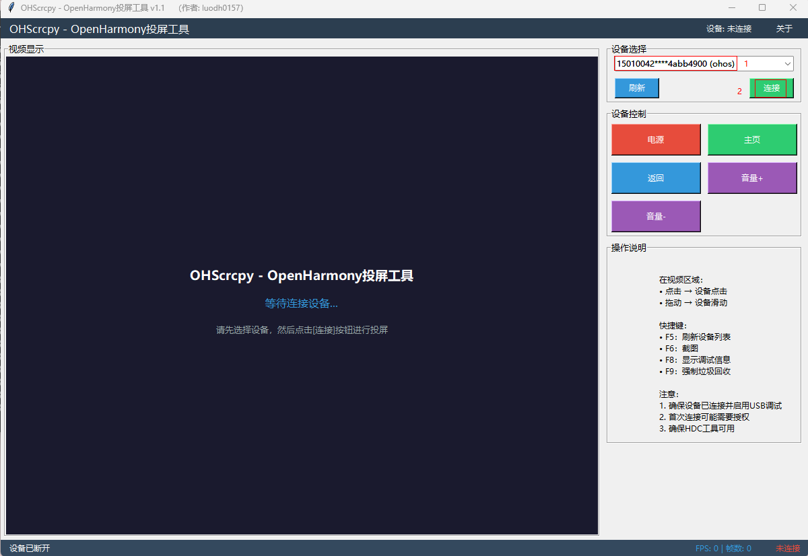
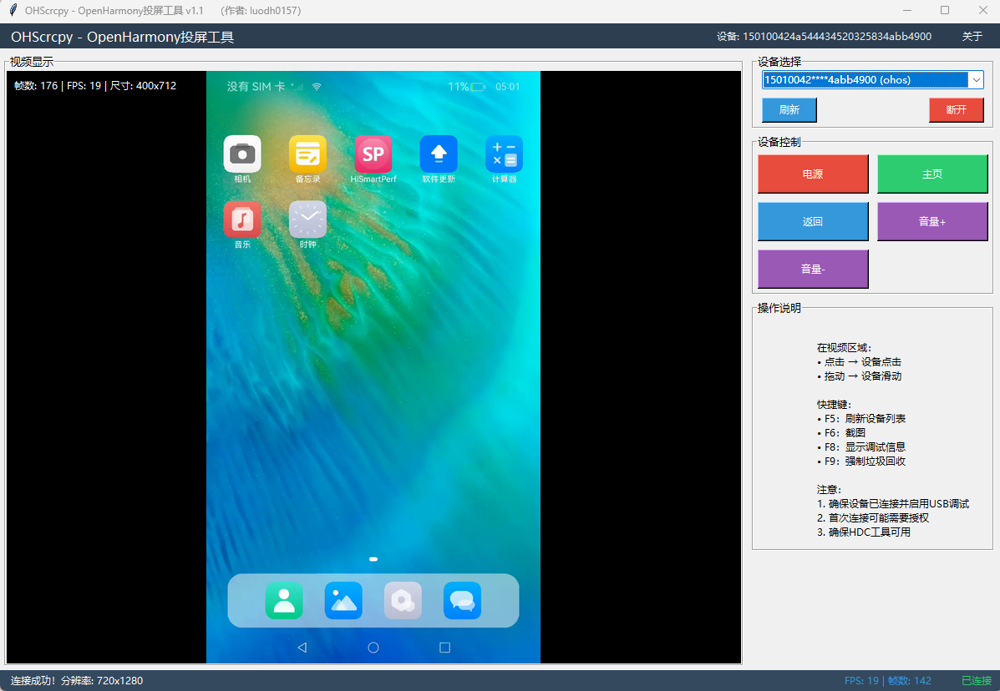

# OHScrcpy_Client - OpenHarmony投屏工具客户端

   OHScrcpy是一款为OpenHarmony系统设计的投屏工具软件，功能类似Android平台的scrcpy投屏工具。它能够将OpenHarmony设备的屏幕实时镜像到计算机，并提供设备控制功能。

## 特性
- **实时屏幕镜像**：低延迟显示OpenHarmony设备屏幕
- **设备控制**：支持点击、滑动、按键等操作
- **多种连接方式**：支持USB连接和网络连接
- **多设备管理**：支持同时连接多个设备并切换
- **自适应分辨率**：自动调整显示尺寸，保持原始比例
- **性能监控**：实时显示FPS、网络状态等统计信息
- **调试功能**：内置调试工具，便于问题排查
- **服务自动安装和启动**：服务端自动安装和启动

## 系统要求
- **操作系统**：Windows 10/11、Linux、macOS
- **Python版本**：Python 3.7或更高版本
- **依赖库**：
   - `numpy`
   - `pillow`
   - `av` (PyAV)
   - `tkinter` (通常Python自带)
- **网络**：支持TCP/IP连接

## 开发指南

### 核心模块
   1. **HDCCommandExecutor**：HDC命令执行器
   2. **DeviceManager**：设备管理器
   3. **H264Decoder**：H.264视频解码器
   4. **VideoStreamClient**：视频流客户端
   5. **DeviceController**：设备控制器
   6. **OHScrcpyGUI**：图形用户界面

### 协议说明
   程序使用自定义TCP协议进行通信：
- 数据包格式：4字节包类型 + 4字节数据长度 + 数据内容
- 包类型：心跳、SPS、PPS、关键帧、普通帧、配置信息

### 安装步骤

#### 1. 安装Python依赖
```bash
pip install numpy pillow av
```

#### 2. 安装HDC工具
   确保HDC（HarmonyOS Device Connector）工具已安装并添加到系统PATH

##### Windows
   1. 从OpenHarmony官网下载HDC工具
   2. 将hdc.exe所在目录添加到系统PATH

##### Linux/macOS
   通常已包含在OpenHarmony SDK中，或着从官网下载并安装

## 使用方法

### 1. 连接设备
   1. **USB连接**：
      - 使用USB数据线连接OpenHarmony设备到计算机
      - 在设备上启用USB调试模式
      - 首次连接时，需要在设备上授权调试权限
   2. **Wi-Fi连接**：
      - 确保设备和计算机在同一局域网或者用网线将设备和计算机直连

### 2. 启动服务端
   无需手动启动，客户端（计算机侧）发起投屏时会自动安装和拉起服务端（OpenHarmony设备侧）

### 3. 启动客户端GUI程序
```bash
python ohscrcpy_client.py
```
   1. 运行程序后，主界面将显示
   2. 点击**刷新**按钮扫描可用设备
   3. 从**设备列表**中选择要连接的设备
   4. 点击**连接**按钮开始投屏




### 4. 基本操作

#### 屏幕控制
- **点击**：在视频区域**单击鼠标左键**
- **滑动**：在视频区域**按住鼠标左键并拖动**
- **缩放**：程序自动适应窗口大小，保持原始比例

#### 按键控制
- **电源键**：点击**电源**按钮
- **主页键**：点击**主页**按钮
- **返回键**：点击**返回**按钮
- **音量+**：点击<strong>音量+</strong>按钮
- **音量-**：点击<strong>音量-</strong>按钮

### 5. 快捷键

| 快捷键 | 功能 |
|--------|------|
| F5 | 刷新设备列表 |
| F6 | 保存当前帧为调试图像 |
| F8 | 显示调试信息窗口 |
| F9 | 强制垃圾回收 |

## 配置说明

### 视频流配置
   程序默认使用以下配置：
- **分辨率**：设备原始分辨率
- **帧率**：30 FPS
- **码率**：1.5 Mbps
- **编码格式**：H.264

### 网络配置
- **默认端口**：27183
- **心跳间隔**：1秒
- **心跳超时**：5秒

## 故障排除

### 常见问题

#### 1. 无法发现设备
- 检查USB连接是否正常
- 确保设备已启用USB调试模式
- 尝试重新插拔USB线缆
- 运行 `hdc list targets` 检查设备识别情况

#### 2. 连接失败
- 检查默认端口**27183**是否被占用
- 确保设备端服务端程序已运行
- 检查防火墙设置

#### 3. 视频卡顿
- 降低视频分辨率设置
- 检查网络连接质量
- 关闭不必要的后台程序

#### 4. 解码错误
- 确保已安装所有Python依赖
- 检查**PyAV**库是否正确安装
- 尝试重启程序

### 调试模式
   启用客户端调试模式获取详细信息：
```python
self.video_client = VideoStreamClient(on_frame_decoded=self._on_frame_decoded, debug=True)
```

## 安全注意事项
   1. **权限管理**：仅在授权的情况下访问设备
   2. **数据安全**：视频流仅在本地网络传输
   3. **隐私保护**：不记录或传输敏感信息

## 免责声明
   本工具仅供学习和研究使用，请勿用于非法用途。使用本工具造成的任何后果，开发者概不负责。

---

**注意**：本软件需要与OpenHarmony设备端的对应服务端程序配合使用，请确保设备端已正确安装并运行服务端程序。